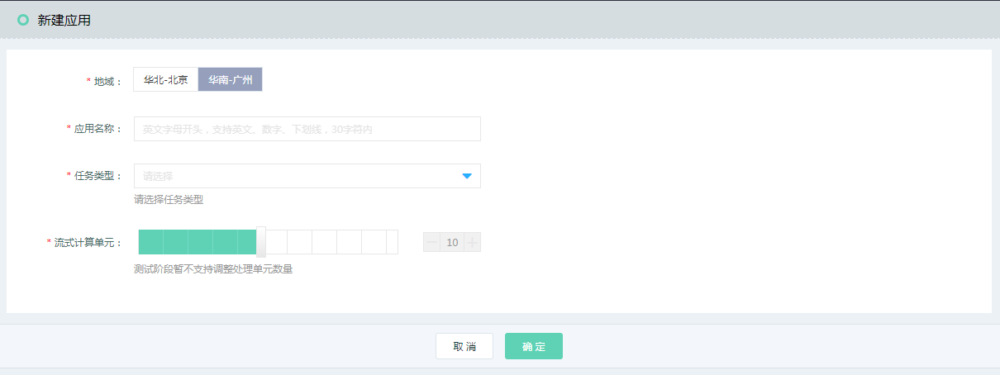
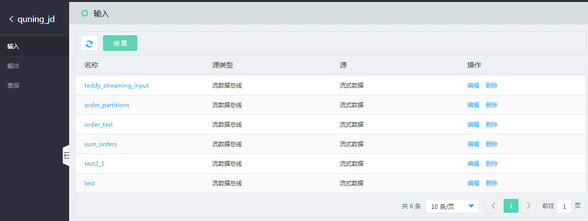
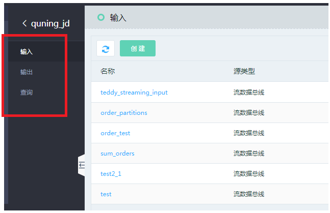
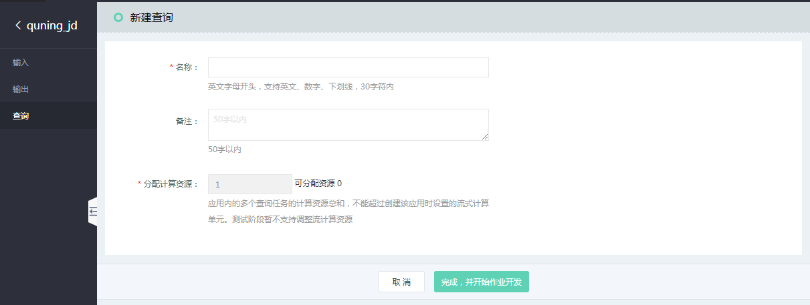
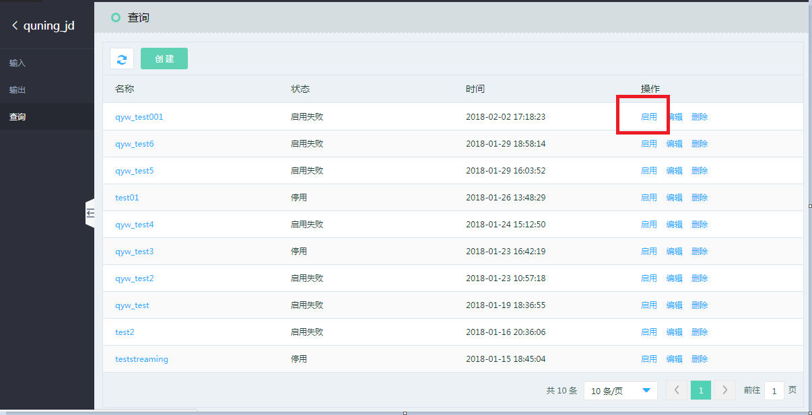

# 入门指南 
1. **准备工作** 
在使用流数据总线服务之前，首先需要注册京东云账号。  
2. **创建应用** 
第一步：登录流计算WEB控制台，进入流计算的“应用管理”页面，点击“创建”。 
  
在创建应用界面中输入资料信息后点击确定, 应用创建完成. 
 
应用名称:  
创建一个方便您记忆的应用名称  
任务类型:  
选择使用的底层计算引擎, 目前提供spark streaming-2.1.0, 后续将提供storm,和flink.  
流式计算单元:  
流式计算单元: 表示执行作业所消耗的计算资源, 一个流式计算单元包含1个CPU和4GB内存  
3. **作业开发** 
在应用列表页, 点击已创建的应用名称后, 进入到作业开发页面, 如下图: 
  
一个完整的流式计算, 需要定义三部分内容, 如下图 
  
4. **输入定义** 
首先需要定义流计算的输入源 
  
5. **输出定义** 
计算完成后的数据需要输出到哪 
  
6. **查询** 
查询即流计算作业开发, 首先需要创建一个进行作业开发的任务, 点击下图中的创建. 
  
  
创建完成后, 点击查询列表的作业名称, 进入开发页面 
  
在开发页面中可以通过SQL的方式进行流式作业的开发. 
 
语句说明: 
`insert into table order_partition select id,order_date from order_partitions`  
在SQL语句中 into table [tablename] 是您在 “输出” 界面定义的输出目标表。 
From [tablename] 是您在 “输入” 界面定义的输入来源.  
作业定义完成后, 在查询列表页,点击 “启动”运行作业任务. 
 
