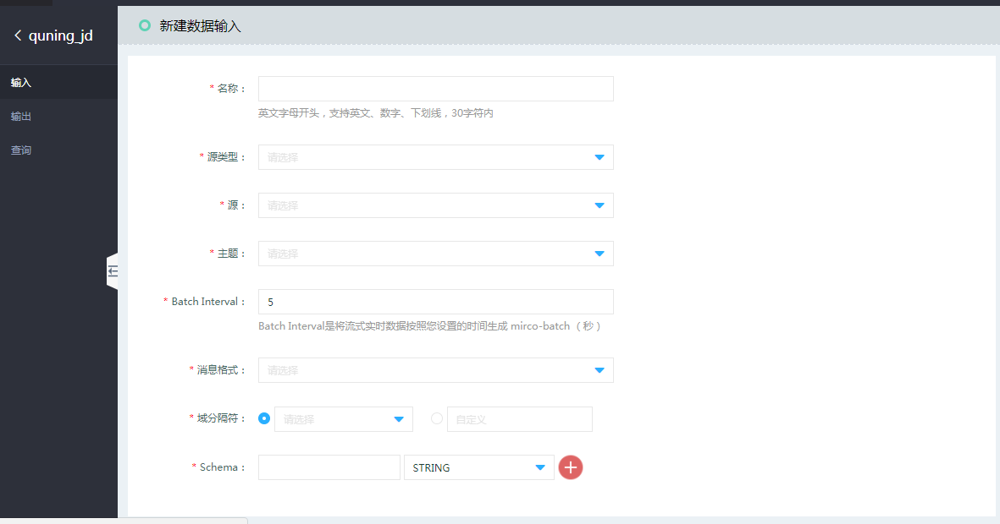
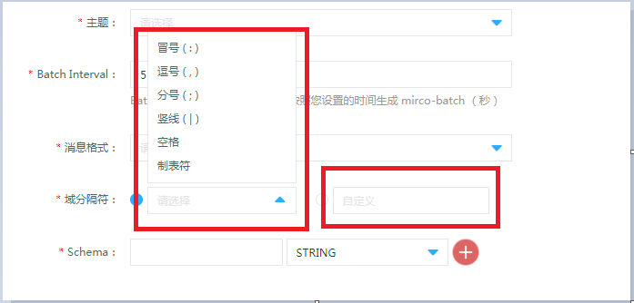
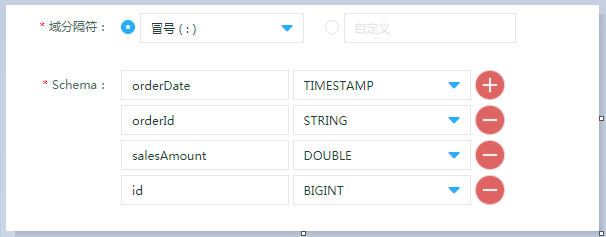

## 数据输入 
在应用列表页, 点击已创建的应用名称后, 进入到作业开发页面, 如下图: 
  
一个完整的流式计算, 需要定义三部分内容, 首先需要先定义数据的 “输入”, 即流计算中的数据从哪来. 
  
点击 “创建”后进入输入源定义页面. 
  
名称:  
输入源的名称, 在后面查询作业的SQL语句中, from [tablename] 的tablename是此处您定义的名称.  
源类型:  
您可以选择来源于 “流数据总线” 中的数据, 在后续的版本迭代中将会提供更加丰富的源类型  
主题:  
您在 “流数据总线”中所创建的主题名称.  
Batch Interval： 
Batch Interval是将流式实时数据按照您此处设置的时间生成 mirco-batch （秒）  
消息格式:  
定义消息格式 JSON 或者 CSV  
分隔符:  
定义流数据总线中消息的分隔符, 以供进行数据解析,进行结构化处理  
  
Schema:  
定义好分隔符后, 在此处定义解析的schema信息, 数据进行结构化处理后方可在流计算中进行处理分析 

