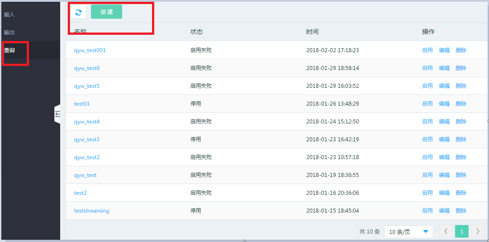
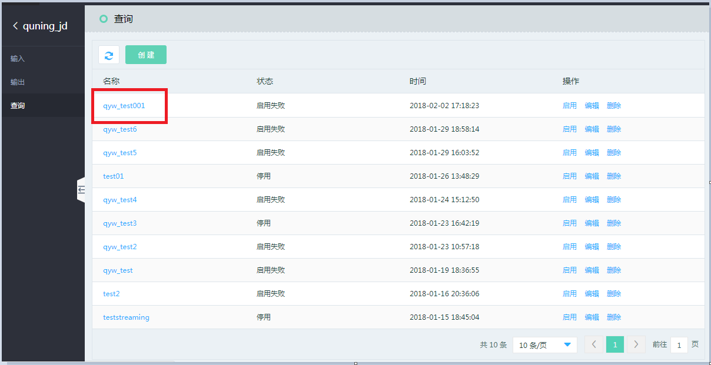
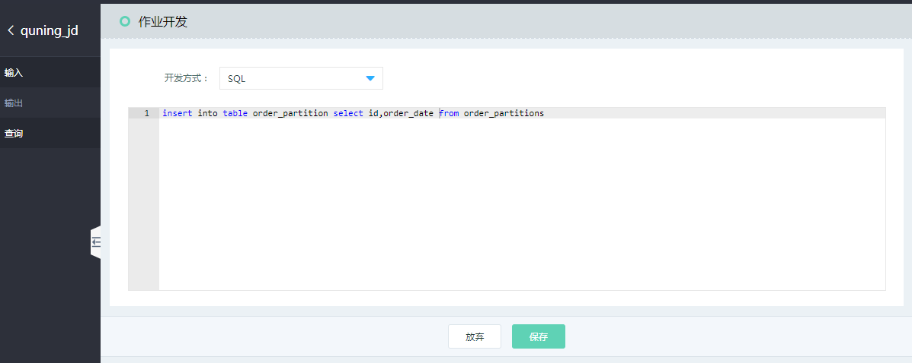

## 作业开发 
查询:  
查询即流计算作业开发, 首先需要创建一个进行作业开发的任务, 点击下图中的创建. 
  
 
分配计算资源: 
应用内的多个查询任务的计算资源总和，不能超过创建该应用时设置的流式计算单元。 
例如, 您在创建应用时选择了20个流式计算单元, 进入应用后创建了4个作业任务, 针对每个作业任务, 您可以独立的分配计算资源, 但是分配给4个作业任务的计算资源总和不能超过创建应用时的流式计算单元数.  
创建完成后, 点击查询列表的作业名称, 进入开发页面 
  
在开发页面中可以通过SQL的方式进行流式作业的开发. 
 
语句说明: 
`insert into table order_partition select id,order_date from order_partitions`  
在SQL语句中 into table [tablename] 是您在 “输出” 界面定义的输出目标表。 
From [tablename] 是您在 “输入” 界面定义的输入来源.  
如果输出端使用的是分区表需要声明分区表信息, 如: 
`insert into table xyc_out1 partition(city)`  
作业定义完成后, 在查询列表页,点击 “启动” 开始运行作业任务. 
 
