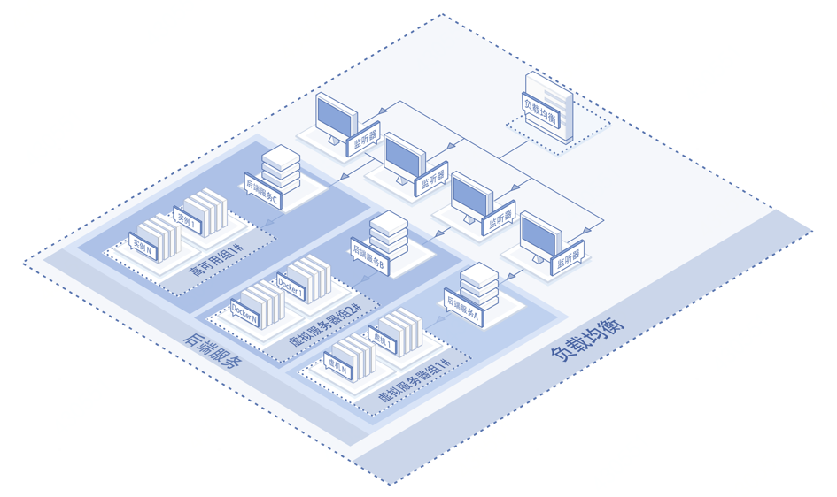

# 基础架构

分布式网络负载均衡采用京东云负载均衡产品统一灵活架构，将负载均衡服务拆分为多个独立的功能模块，以适应各类场景需求，使用户操作更加灵活便捷。

  
各功能模块含义

#### 负载均衡实例

使用负载均衡服务前，需要创建负载均衡实例。一个负载均衡实例可设置多个监听器、多个后端服务、多个虚拟服务器组和高可用组。分布式网络负载均衡实例用于提供分布式、四层、无状态的负载均衡服务。
#### 监听器

用于监听需要进行负载均衡服务的业务请求。每个负载均衡实例需设置至少一个监听器，指定监听协议、端口等。
#### 后端服务

用于提供从负载均衡到后端服务器转发、调度策略的管理模块，包括转发协议/端口、调度算法、后端服务器组、健康检查等。
#### 虚拟服务器组

一组接受负载均衡分发的业务请求的云主机或容器实例资源，虚拟服务器组对实例进行管理。虚拟服务器组可以与弹性伸缩（Auto Scaling）结合使用，以实现云主机的自动扩容与缩容。不过AS的云主机分散能力较弱，不关注跨机架维度的高可用分散机制。
#### 高可用组

高可用组（Availability Group）是京东云提供的云主机的逻辑集合，可以支持按照业务负载情况自动进行跨机架、跨AZ的云主机弹性伸缩，将云主机分散部署在相互隔离的物理资源上。当出现硬件或者供电故障时，只会影响高可用组内部分云主机，以保证用户业务正常使用。

## 高复用架构说明

京东云负载均衡产品的统一灵活架构可实现功能模块的复用。用户可根据不同场景的业务需求，灵活复用各功能模块，从而简化用户配置。

* 同一负载均衡下可以设置多个协议类型相同但端口号不同的监听器，以监听多个业务请求。
* 同一负载均衡下的多个监听器可以复用绑定同一个后端服务。
* 同一负载均衡下的多个后端服务可以复用绑定同一个虚拟服务器组/高可用组。
* 同一虚拟服务器（云主机/容器）可注册到不同的虚拟服务器组。
* 同一高可用组可以挂接到多个负载均衡的后端服务。

## 相关参考

- [产品优势](../Introduction/Benefits.md)
- [产品功能](../Introduction/Features.md)
- [产品定价](../Pricing/Billing-Overview.md)
- [创建DNLB实例](../Operation-Guide/Create-DNLB-Instance.md)
- [创建虚拟服务器组](../Operation-Guide/TargetGroup-Management.md)
- [配置监听策略](../Operation-Guide/Listener-Management.md)
- [管理后端服务与查看服务实例健康状态](../Operation-Guide/Backend-Management.md)

