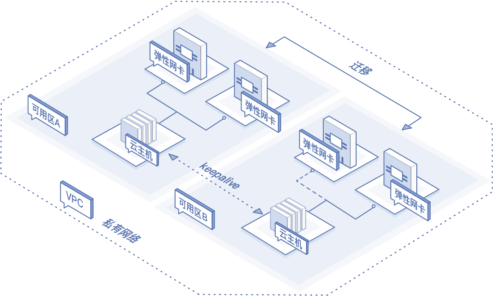

# 云主机高可用性架构

本教程将指导您通过使用keepalived工具构建跨可用区的高可靠应用解决方案。在发生故障时，可以通过弹性网卡由主服务器迁移至备用服务器的方式实现故障屏蔽。本教程主要适用于业务需要高可靠部署的场景，特别是安全策略与网卡MAC地址强关联的场景。

## 业务场景架构

## 开始之前
- 在同一私有网络内，分别在可用区A与可用区B中创建1台云主机，并设定合适的安全组策略。
- 在同一私有网络内，依据网络规划选定1个子网，并在该子网中创建1块弹性网卡。

## 操作步骤
- 步骤1：登录京东云控制台，进入弹性网卡列表页，选定之前创建的辅助弹性网卡，并将该弹性网卡绑定至可用区A云主机

- 步骤2：通过SSH分别登录至可用区A云主机与可用区B云主机，安装配置keepalived工具，启用单播VRRP监听模式

- 步骤3：编写keepalived切换函数，调用京东云弹性网卡Open API，解绑弹性网卡并重新绑定至备用服务器，在发生故障切换时调用该函数配置备用主机网卡与路由。

## 后续测试
- 主、备服务器均部署完成后，可以关停主服务器，在控制台查看弹性网卡是否迁移至备用服务器。访问弹性网卡IP，如果可以连通，则证明切换成功。。