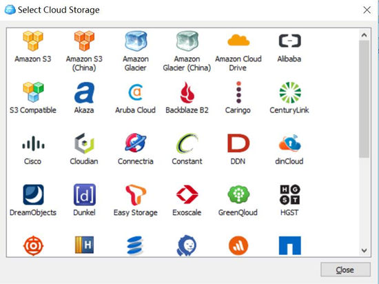
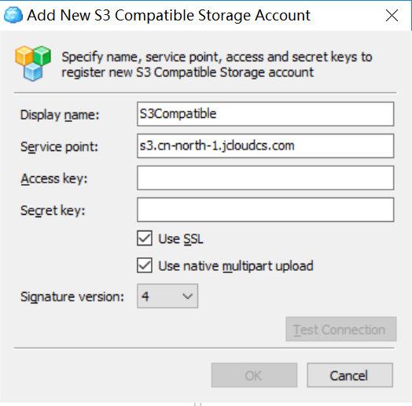

# 使用CloudBerry管理OSS

## 简介

CloudBerry Explorer 是业界开发的一Windows 下直接通过 CloudBerry Explorer 来接入并管理对象存储的文件浏览器。您也可以通过CloudBerry Explorer来接入并管理京东云OSS。

CloudBerry主要功能包括：支持AK/SK登录，管理Bucket、管理Object、上传与下载、外链、同步等。

更多详细操作请下载[《京东云对象存储CloudBerry使用手册》](http://downloads.oss.cn-north-1.jcloudcs.com/%25E4%25BA%25AC%25E4%25B8%259C%25E4%25BA%2591%25E5%25AF%25B9%25E8%25B1%25A1%25E5%25AD%2598%25E5%2582%25A8CloudBerry%25E4%25BD%25BF%25E7%2594%25A8%25E6%2589%258B%25E5%2586%258C.pdf)

## 使用CloudBerry接入OSS

CloudBerry下载地址：http://www.cloudberrylab.com/download-thanks.aspx?prod=cbes3free

使用 CloudBerry 之前，您需要事先在京东云中注册账号，并开通京东云对象存储服务（OSS）。

通过 CloudBerry 来接入 OSS 中的具体步骤如下。

步骤 1 在右侧的 Source 下拉菜单中点击“New Storage Account”，在弹框中选择S3 Compatible

步骤 2 在弹出的对话框中，填写相应参数：

Display name：显示名称，一般填自己的用户名即可。

Service point：填写京东云[兼容S3的服务域名](https://docs.jdcloud.com/cn/object-storage-service/regions-and-endpoints)。

Access key、Secret key：接入 OSS 服务的 AK、SK。

Use SSL：是否使用 SSL，建议勾选该选项。

Use native multipart upload（recommended）：是否使用分片上传

Signature version：选择4

步骤 3 单击“Test Connection”，测试是否能连接成功，或者直接单击“OK”进行连接。

连接成功之后，将看到账户（如 jcloud）下面对应的Bucket列表，如下图所示。

